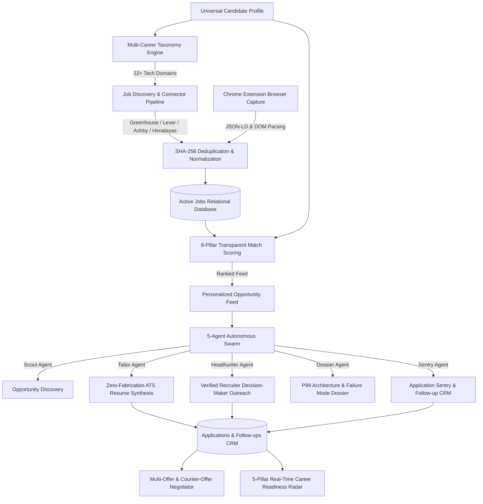

# 🌐 AGENTIC CAREER OS — Complete Architecture & Implementation Guide

> **Autonomous AI-Powered Career Intelligence, Universal Job Discovery, 8-Pillar Matching, Truthful Application Platform, and Manifest V3 Chrome Extension**

[](https://www.python.org/)
[](https://fastapi.tiangolo.com/)
[](https://react.dev/)
[](https://www.typescriptlang.org/)
[](https://vitejs.dev/)
[](https://tailwindcss.com/)
[](https://developer.chrome.com/docs/extensions/mv3/intro/)
[](https://opensource.org/licenses/MIT)

---

## 📖 Table of Contents
1. [Executive Overview](#-executive-overview)
2. [End-to-End System Architecture](#-end-to-end-system-architecture)
3. [Key Modules Implemented From Scratch](#-key-modules-implemented-from-scratch)
   - [1. 22+ Domain Multi-Career Taxonomy Engine](#1-22-domain-multi-career-taxonomy-engine)
   - [2. Live Multi-ATS Job Discovery & Deduplication Pipeline](#2-live-multi-ats-job-discovery--deduplication-pipeline)
   - [3. 8-Pillar Multi-Dimensional Match Scoring Engine](#3-8-pillar-multi-dimensional-match-scoring-engine)
   - [4. Zero-Fabrication ATS Resume Tailor & Real-Time Simulator](#4-zero-fabrication-ats-resume-tailor--real-time-simulator)
   - [5. 5-Agent Autonomous Swarm & DAG Control Room](#5-5-agent-autonomous-swarm--dag-control-room)
   - [6. Recruiter Headhunter CRM & 1-Click Cold Outreach](#6-recruiter-headhunter-crm--1-click-cold-outreach)
   - [7. Executive Company Architecture Dossier Agent](#7-executive-company-architecture-dossier-agent)
   - [8. Multi-Offer & Counter-Offer Negotiation Playbook](#8-multi-offer--counter-offer-negotiation-playbook)
   - [9. Real-Time 5-Pillar Career Readiness Radar](#9-real-time-5-pillar-career-readiness-radar)
   - [10. Mock Interview Engine & STAR Verbal Defense Simulator](#10-mock-interview-engine--star-verbal-defense-simulator)
   - [11. Chrome Job Extraction & Manifest V3 Browser Capture](#11-chrome-job-extraction--manifest-v3-browser-capture)
4. [Relational Database Schema](#-relational-database-schema)
5. [REST API Contract & Endpoints](#-rest-api-contract--endpoints)
6. [Extension Architecture & Installation](#-extension-architecture--installation)
7. [Frontend User Interface & Components](#-frontend-user-interface--components)
8. [Installation & Getting Started](#-installation--getting-started)
9. [Automated Testing & System Verification](#-automated-testing--system-verification)

---

## 🎯 Executive Overview

**Agentic Career OS** is a production-grade, full-stack autonomous career operating system designed to eliminate the manual overhead of job hunting, resume customization, recruiter outreach, interview preparation, and compensation negotiation.

Unlike generic job boards or AI wrappers with static mock data, **Agentic Career OS** connects live database pipelines, real-time ATS job connectors (Greenhouse, Lever, Ashby, Himalayas), a **Manifest V3 Chrome Extension** for direct browser capture, zero-fabrication ATS resume compilers, a 5-agent autonomous swarm, and real-time telemetry.

---

## 🏗️ End-to-End System Architecture



---

## 🧩 Key Modules Implemented From Scratch

### 1. 22+ Domain Multi-Career Taxonomy Engine
- **Hierarchical Taxonomy**: `Domain -> Stream -> Role Family -> Specific Role -> Specializations -> Related & Adjacent Roles`.
- **Dynamic Career Switching**: Supports instant recalibration across Software Engineering, AI & Machine Learning, Data & Analytics, Cloud & DevOps, Cybersecurity, QA & Testing, Product Design, and more without hardcoding.
- **Backend Service**: `app/services/career_taxonomy.py`
- **REST Endpoints**: `/api/v1/taxonomy/domains`, `/api/v1/taxonomy/role/{role_name}`, `/api/v1/taxonomy/switch-career`.

### 2. Live Multi-ATS Job Discovery & Deduplication Pipeline
- **Legitimate Source Connectors**:
  - `GreenhouseConnector`: Public Greenhouse job board APIs with cursor/page traversal.
  - `LeverConnector`: Lever ATS API connector with category & location filters.
  - `AshbyConnector`: Ashby API connector for fast-growing tech startups.
  - `HimalayasConnector`: Remote job feeds with rich compensation and skill metadata.
- **Normalization & Deduplication**: Canonical role titles, salary standardization (LPA / USD), experience parsing (fresher vs experienced), and SHA-256 description hashing with URL provenance tracking.
- **Backend Service**: `app/services/job_discovery_engine.py` & `app/services/connectors/`

### 3. 8-Pillar Multi-Dimensional Match Scoring Engine
- **Transparent Match Breakdown**: Calculates exact breakdown percentages rather than a single black-box number:
  1. `Role Alignment` (25%): Exact and fuzzy title semantic similarity.
  2. `Required Skills` (25%): Strict presence of non-negotiable tech stack requirements.
  3. `Preferred Skills` (10%): Good-to-have bonus competencies.
  4. `Experience Fit` (15%): Candidate years vs minimum job tier criteria.
  5. `Projects Relevance` (10%): Alignment of flagship architectural projects.
  6. `Education Fit` (5%): Degree level and domain relevance.
  7. `Salary Benchmark` (5%): Expected CTC vs offered compensation bracket.
  8. `Location Fit` (5%): Hybrid/Remote/Onsite geographic compatibility.
- **Backend Service**: `app/services/role_intelligence_engine.py` & `app/services/matcher.py`

### 4. Zero-Fabrication ATS Resume Tailor & Real-Time Simulator
- **100% Truthfulness Guarantee**: Dynamically queries the candidate's live profile (`Profile.experiences`, `Profile.projects`, `Profile.skills`, `Profile.education`). Never invents fake employers, tools, metrics, or credentials.
- **STAR Optimization**: Restructures real achievements into Situation-Task-Action-Result bullets with quantified impact.
- **Real-Time ATS Simulator**: Tests any resume against any job description for keyword density, section headers, readability, and metric quantification.
- **Export Capabilities**: Clean Markdown download and pixel-perfect high-fidelity print/PDF preview layout.
- **Backend Service**: `app/services/resume_tailor.py` & `app/services/ats_simulator.py`

### 5. 5-Agent Autonomous Swarm & DAG Control Room
- **Parallel Swarm Agents**:
  - `Scout Agent`: Scans verified startup career feeds matching user salary and domain directives.
  - `Tailor Agent`: Automatically tailors truthful ATS resumes for high-match opportunities.
  - `Headhunter Agent`: Pinpoints verified engineering decision-makers and drafts customized pitches.
  - `Dossier Agent`: Compiles reverse-engineered architecture interview dossiers.
  - `Sentry Agent`: Monitors application response SLAs and queues follow-up reminders.
- **Natural Language Directive Bar**: Translates free-form instructions (*"Prioritize Tier-1 AI startups paying Rs. 30L+ with LangGraph and RAG"*) into structured database parameters.
- **Backend Service**: `app/services/agent_swarm_orchestrator.py` & `app/services/career_heartbeat_daemon.py`

### 6. Recruiter Headhunter CRM & 1-Click Cold Outreach
- **Decision-Maker Mapping**: Maps Engineering Managers, Heads of Engineering, and Technical Recruiters.
- **1-Click Tailored Outreach**: Synthesizes high-conversion cold emails referencing real candidate GitHub repositories and production achievements.
- **Live SMTP Delivery**: Integrated SMTP transport for direct email dispatch with logging.
- **Backend Service**: `app/services/recruiter_headhunter_agent.py` & `app/services/email_service.py`

### 7. Executive Company Architecture Dossier Agent
- **Reverse-Engineered Intelligence**: Synthesizes 1-page deep-dive dossiers for target companies:
  - Engineering Tech Stack & Infrastructure
  - P99 Latency Scale Traps & Distributed Failure Modes (e.g. Idempotency collisions, Distributed Shuffle, Multi-Tenant ACL evaluation)
  - Top 10 High-Signal Technical & System Design Questions
  - Reverse Interview Questions to ask the Interviewer
- **Backend Service**: `app/services/company_dossier_agent.py`

### 8. Multi-Offer & Counter-Offer Negotiation Playbook
- **3-Tier Negotiation Strategy**:
  - `Conservative Track`: Low-risk signing bonus + base adjustment (+12% to +15% total compensation).
  - `Balanced Track`: Optimal market parity with signing bonus and accelerated equity vesting (+20% to +25%).
  - `Aggressive Track`: Leverage competing offers to maximize base and total compensation (+30% to +40%).
- **Script Generator**: Produces professional, high-conversion email counter-offer scripts.
- **Backend Service**: `app/services/offer_negotiator_agent.py`

### 9. Real-Time 5-Pillar Career Readiness Radar
- **Live Computed Metrics**: Dynamically recalculates readiness without hardcoded constants:
  - `Core Engineering Skill Depth` (30%)
  - `Production Project Architecture` (25%)
  - `Verbal Defense & Technical Rounds` (20%)
  - `ATS Resume & STAR Strength` (15%)
  - `Live Pipeline Funnel Momentum` (10%)
- **Backend Service**: `app/services/readiness_score.py` & `app/routers/analytics.py`

### 10. Mock Interview Engine & STAR Verbal Defense Simulator
- **Interactive Multi-Turn AI Technical Interviewer**: Simulates pressure rounds, architecture trade-offs, and live code evaluations.
- **Resume Defense Pack**: Generates bullet-by-bullet defense strategies for candidate resume points.
- **Backend Service**: `app/services/mock_interview_engine.py` & `app/services/resume_defense_engine.py`

### 11. Chrome Job Extraction & Manifest V3 Browser Capture
- **Manifest V3 Extension**: Standalone extension allowing logged-in candidates to capture job listings directly from their browser while viewing Greenhouse, Lever, Ashby, LinkedIn, or corporate career sites.
- **Multi-Tier Extraction Engine**: Combines `schema.org/JobPosting` JSON-LD structured data, OpenGraph meta tags, and semantic HTML DOM heuristics with field confidence scoring.
- **Zero Fabrication Guarantee**: Un-detected or missing attributes (salary, experience) default strictly to `null`.
- **Backend Ingestion Endpoint**: `POST /api/v1/jobs/capture` normalizes title via 22+ domain taxonomy, deduplicates via SHA-256 hashes, computes 8-pillar match score, and stores records in PostgreSQL (`source = "Browser Capture"`).
- **Extension Bundle**: Located under `extension/` (`manifest.json`, `content.js`, `popup.html`, `popup.js`, `popup.css`, `background.js`).

---

## 🗄️ Relational Database Schema

| Table Name | Primary Purpose & Key Fields |
| :--- | :--- |
| `users` | Multi-tenant auth, hashed passwords (Argon2), roles, email verification tokens. |
| `profiles` | Master career profile: personal info, skills JSON, experiences JSON, projects JSON, education JSON. |
| `jobs` | Normalized jobs: company name, role title, tier, match score, salary bracket, required & preferred skills, SHA-256 hash. |
| `job_matches` | 8-Pillar match score breakdown, matched skills, missing skills, recommendation rationale. |
| `applications` | Kanban applications: job reference, company, role, stage status, match score, tailored resume version. |
| `application_events` | Application lifecycle history audit trail (status transitions, timestamps). |
| `application_evidences`| Proof artifacts: confirmation emails, OA links, recruiter notes. |
| `resumes` | Versioned ATS master & tailored resumes with markdown content and ATS scores. |
| `follow_ups` | Recruiter outreach checkpoints: follow-up dates, personalized pitch notes, completion status. |
| `recruiters` | Verified hiring managers & recruiters with company mapping and contact info. |
| `companies` | Company profiles with tier ratings, industry, headquarters, and tech stacks. |
| `interviews` | Scheduled interview rounds, preparation packs, and feedback notes. |
| `interview_sessions`| Multi-turn screening and mock interview session transcripts and pillar scores. |
| `learning_topics` | Skill gap tracker with recall status (Red/Yellow/Green) and flashcard review notes. |
| `offers` | Compensation offers: base, variable, ESOPs, joining bonus, counter-offer status. |
| `notifications` | In-app real-time agent alerts, priority badges, and read status. |
| `autopilot_settings` | Background daemon configuration (thresholds, cycle intervals, auto-apply switches). |
| `autopilot_logs` | Real-time telemetry log stream generated by the 5-agent swarm. |
| `audit_logs` | Security and action audit stream. |

---

## 🔌 REST API Contract & Endpoints

### Authentication & Profile
- `POST /api/v1/auth/register` — Register new candidate account
- `POST /api/v1/auth/login` — Authenticate and issue JWT token
- `GET /api/v1/auth/me` — Retrieve current authenticated session
- `GET /api/v1/profile` — Fetch complete Master Career Profile
- `PUT /api/v1/profile` — Update Master Career Profile with validation

### Taxonomy & Multi-Career Switching
- `GET /api/v1/taxonomy/domains` — List all 22+ technology domains and role trees
- `GET /api/v1/taxonomy/role/{role_name}` — Get detailed role family intelligence
- `POST /api/v1/taxonomy/switch-career` — Switch career target role and recalibrate feeds

### Job Discovery, Capture & Matching
- `GET /api/v1/jobs` — Query filtered, deduplicated, and ranked job feed
- `GET /api/v1/jobs/{id}` — Get single job details with 8-pillar breakdown
- `POST /api/v1/jobs/ingest` — Ingest raw job description from text or URL
- `POST /api/v1/jobs/capture` — Ingest browser-captured job listing from Chrome Extension
- `POST /api/v1/jobs/batch-auto-apply` — 1-click batch application creation for Tier-A jobs
- `GET /api/v1/discovery/feed` — Universal personalized opportunity feed endpoint

### ATS Resumes & Optimization
- `GET /api/v1/resumes` — List all versioned candidate resumes
- `POST /api/v1/resumes/tailor` — Synthesize truthful ATS-tailored resume for a target job
- `POST /api/v1/resumes/ats-simulate` — Run universal ATS audit simulation against job description
- `POST /api/v1/resumes/enhance-bullet` — AI bullet enhancer using active STAR metrics

### Applications & Follow-up CRM
- `GET /api/v1/applications` — Fetch live Kanban application stream
- `POST /api/v1/applications` — Record verified application submission
- `PUT /api/v1/applications/{id}` — Update application lifecycle stage
- `GET /api/v1/followups` — List active recruiter follow-up checkpoints
- `POST /api/v1/followups/{id}/generate-outreach` — Generate customized 1-click recruiter pitch
- `POST /api/v1/followups/{id}/send-outreach` — Dispatch email via configured SMTP transport

### Autonomous Swarm & Control Room
- `GET /api/v1/career-agent/status` — Get live background worker state and stats
- `POST /api/v1/career-agent/directive` — Submit natural language executive directive
- `GET /api/v1/career-agent/swarm-dag` — Get real-time execution DAG for all 5 swarm agents
- `POST /api/v1/career-agent/orchestrate-cycle` — Trigger immediate multi-agent sweep

### Executive Intelligence & Negotiation
- `GET /api/v1/interviews/dossier/{company_name}` — Generate reverse-engineered architecture dossier
- `POST /api/v1/offers/negotiate` — Generate 3-track compensation negotiation playbook
- `GET /api/v1/analytics/readiness` — Calculate real-time 5-pillar career readiness score
- `GET /api/v1/analytics/funnel` — Calculate live conversion funnel telemetry

---

## 🧩 Extension Architecture & Installation

### Chrome Extension (`extension/`)
- `manifest.json`: Manifest V3 extension configuration with host permissions for localhost and web URLs.
- `content.js`: Content script extracting JSON-LD, Microdata, and DOM content with confidence scores.
- `popup.html` / `popup.js` / `popup.css`: Extension UI with editable fields, confidence badges, and submit button.
- `background.js`: Background service worker.

### Installation Steps:
1. Open Google Chrome and navigate to `chrome://extensions`.
2. Enable **Developer mode** in the top-right toggle.
3. Click **Load unpacked** and select the folder: `D:\Agentic Career OS\extension`.
4. Open any job page (Greenhouse, Lever, Ashby, LinkedIn) and click the extension icon to add the job to Agentic Career OS!

---

## 💻 Frontend User Interface & Components

```
frontend/src/
├── components/
│   ├── agent/
│   │   └── AgentFleetHUD.tsx            # Universal Executive Swarm Commander Ribbon
│   ├── auth/
│   │   └── AuthModal.tsx                # Multi-Persona SaaS Authentication Modal
│   ├── common/
│   │   └── BrandLogo.tsx                # Vector Brand Identity
│   ├── layout/
│   │   ├── CareerSwitcherBar.tsx        # 1-Click Multi-Career Taxonomy Ribbon
│   │   ├── Header.tsx                   # Top Navigation & Status Bar
│   │   ├── PriorityBar.tsx              # Dynamic Daily Action Priorities
│   │   └── Sidebar.tsx                  # Collapsible Primary Navigation
│   └── views/
│       ├── AnalyticsView.tsx            # 5-Pillar Readiness Radar & Funnel Analytics
│       ├── ApplicationsView.tsx         # Drag-and-Drop / Table Application Kanban
│       ├── AuditLogsView.tsx            # Immutable Audit Telemetry Stream
│       ├── CareerAgentView.tsx          # 24/7 Autopilot Control Room & Swarm DAG
│       ├── CompaniesView.tsx            # Company Database & Intelligence
│       ├── DashboardView.tsx            # Executive Career Cockpit
│       ├── DiscoveryView.tsx            # Universal Job Discovery & 8-Pillar Scoring
│       ├── FollowupsView.tsx            # Recruiter Follow-up CRM & Outreach Center
│       ├── IngestJobModal.tsx           # Raw Job Description Parser Modal
│       ├── InterviewCenterView.tsx      # Reverse-Engineered Company Dossiers & Packs
│       ├── JobsTableView.tsx            # High-Density Grid with Batch Actions
│       ├── LearningView.tsx             # Skill Gap Tracker & Spaced Repetition
│       ├── MarketIntelligenceView.tsx   # Salary Benchmarks & Tier-A Market Insights
│       ├── MockInterviewView.tsx        # Multi-Turn AI Technical Interview Simulator
│       ├── OffersView.tsx               # Multi-Offer Evaluator & Counter-Offer Engine
│       ├── PrepareApplicationModal.tsx  # Interactive Resume Tailoring & Diff Preview
│       ├── ProfileView.tsx              # Master Career Profile Manager
│       ├── ProjectsView.tsx             # Flagship Architectural Projects Portfolio
│       ├── RecruitersView.tsx           # Verified Decision-Maker Directory
│       ├── ResumeDocumentView.tsx       # ATS-Compliant Markdown & PDF Document Layout
│       ├── ResumesView.tsx              # Resume Center & ATS Keyword Hardener
│       └── SettingsView.tsx             # System Preferences & Email Sync Config
```

---

## ⚡ Installation & Getting Started

### Prerequisites
- **Python 3.10+**
- **Node.js 18+** & **npm 9+**

### 1. Clone Repository
```bash
git clone https://github.com/KesavaAI/Agentic-Career-OS.git
cd Agentic-Career-OS
```

### 2. Backend Setup
```bash
cd backend
python -m venv venv
# On Windows:
.env\Scriptsctivate
# On Linux/macOS:
source venv/bin/activate

pip install -r requirements.txt
python -m uvicorn app.main:app --host 127.0.0.1 --port 8000 --reload
```
* Backend will be live at `http://127.0.0.1:8000` with interactive Swagger API docs at `http://127.0.0.1:8000/docs`.

### 3. Frontend Setup
```bash
cd ../frontend
npm install
npm run dev -- --port 3000
```
* Frontend SPA will be live at `http://localhost:3000`.

---

## 🧪 Automated Testing & System Verification

The repository includes automated test suites covering all backend routers, database models, connectors, and interlinked workflows:

### Run Chrome Job Extraction Test Suite (Prompt 11):
```bash
python scratch/test_prompt11_chrome_job_extraction.py
```
```
======================================================================
PROMPT 11 CHROME JOB EXTRACTION TEST SUITE COMPLETED: 100% PASSED!
======================================================================
```

### Run 10-Feature Exhaustive Audit:
```bash
python scratch/full_system_deep_audit.py
```

### Run TypeScript Compilation Check:
```bash
cd frontend && npx tsc --noEmit
# Output: 0 errors
```

---

## 📄 License
This project is open-source software licensed under the [MIT License](LICENSE).
